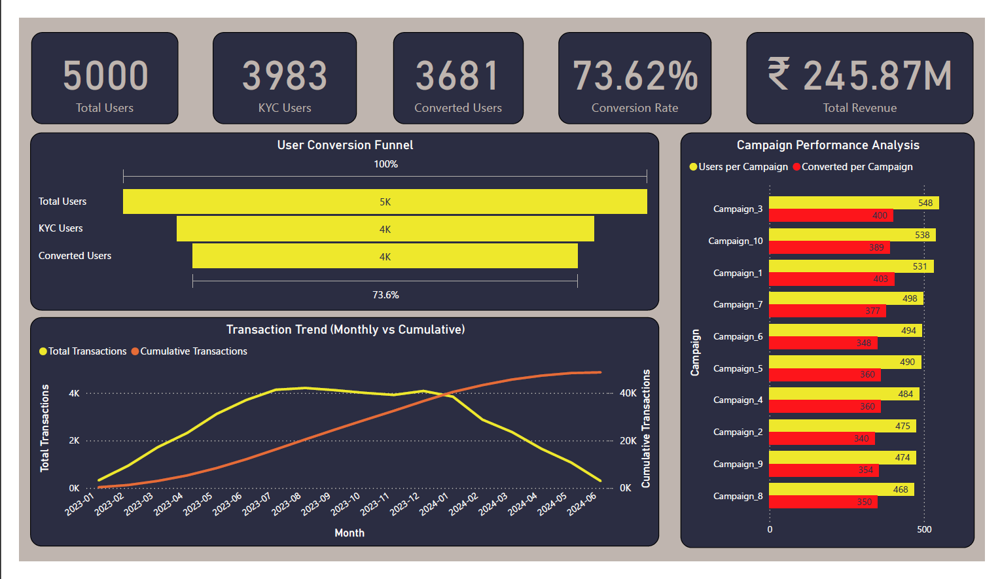
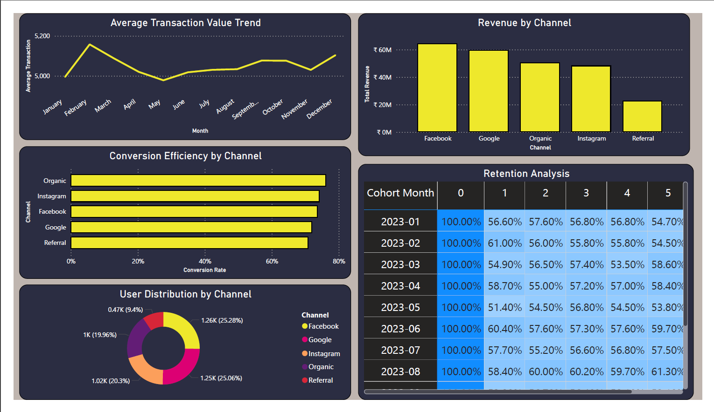
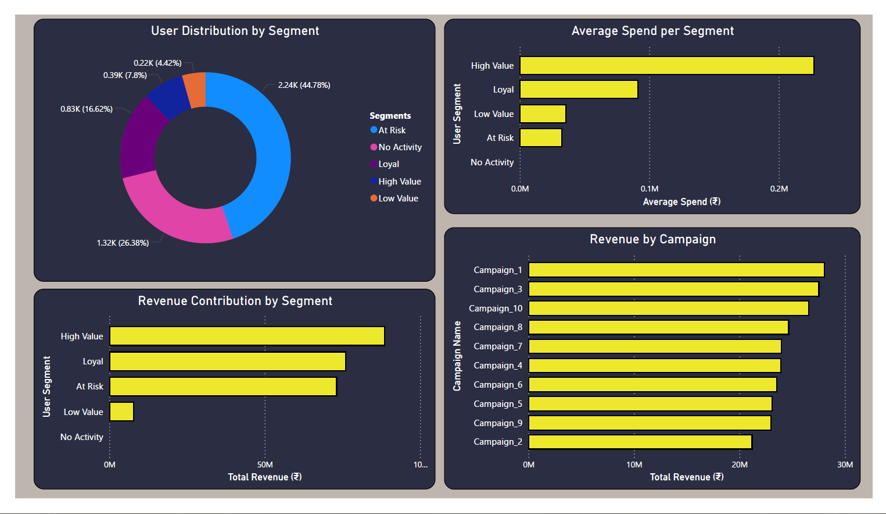

# 📊 Fintech Product Analytics & User Behaviour Analysis

---

## 🚀 Overview

This project simulates a real-world fintech product analytics workflow by analyzing user onboarding behavior, transaction activity, acquisition performance, and retention patterns.

The objective is to derive meaningful business insights that help improve user conversion, engagement, and long-term retention using Python, SQL, and Power BI.

---

## 💼 Business Problem

Fintech platforms need to answer critical questions such as:

* Which acquisition channels bring the most valuable users?
* Where do users drop off during onboarding?
* How do users behave after their first transaction?
* Are users retained over time?
* Which segments contribute most to revenue?

This project addresses these questions through structured data analysis and visualization.

---

## 🎯 Objectives

* Analyze onboarding and conversion performance
* Evaluate acquisition channel effectiveness
* Study transaction and revenue trends
* Perform cohort-based retention analysis
* Build an interactive Power BI dashboard for decision-making

---

## 🛠️ Tech Stack

| Category | Tools |
|--------|--------|
| Programming | Python |
| Data Processing | Pandas, NumPy |
| Querying | SQL |
| Visualization | Power BI |
| Development | VS Code, Jupyter Notebook |

## 🗂️ Dataset

The dataset was synthetically generated to mimic realistic fintech user behavior.

### 👤 Users Dataset (~5,000 records)

* user_id
* signup_date
* acquisition_channel
* kyc_completed
* is_converted

---

### 💳 Transactions Dataset (~50,000 records)

* transaction_id
* user_id
* transaction_date
* transaction_amount

---

## 📊 Key Metrics

### Product Metrics

* Total Users
* KYC Completion Rate
* Conversion Rate

### Transaction Metrics

* Total Transactions
* Total Revenue
* Average Transaction Value

### Retention Metrics

* Cohort Retention Rate
* User Repeat Behavior

### Acquisition Metrics

* Users by Channel
* Conversion Rate by Channel
* Revenue Contribution by Channel
* Average Revenue per User (ARPU)

---

## 🧠 SQL Analysis

SQL was used to extract key business insights such as:

* Funnel conversion rates
* Transaction summaries
* Acquisition channel performance
* Revenue aggregation
* User-level behavioral metrics

Example:

```sql
SELECT 
    acquisition_channel,
    COUNT(DISTINCT user_id) AS users,
    SUM(transaction_amount) AS revenue
FROM transactions t
JOIN users u
ON t.user_id = u.user_id
GROUP BY acquisition_channel;
```

---

## 📊 Dashboard Overview

The Power BI dashboard is divided into two focused analytical pages.

---

### 🟦 Page 1 — Business Performance Overview

This page provides a high-level view of overall product performance.

**Includes:**

* Transaction trends over time (monthly & cumulative)
* Revenue growth analysis
* Conversion performance
* Key business KPIs

---

### 🟩 Page 2 — User Behavior & Acquisition Insights

This page focuses on understanding user quality and channel effectiveness.

**Includes:**

* User distribution by acquisition channel
* Conversion rate comparison across channels
* Revenue contribution by channel
* Average revenue per user (ARPU)
* Cohort-based retention heatmap

---

## 📷 Dashboard Screenshots

### 🔹 Page 1 — Business Performance Overview



---

### 🔹 Page 2 — User Behavior & Acquisition Insights



---

### 🔹 Page 3 — Customer Segmentation & Campaign Insights



---

## 📈 Key Insights

* 📉 A noticeable drop-off occurs between user signup and conversion stage
* 📣 Referral channels demonstrate higher conversion efficiency compared to paid channels
* 💰 Revenue is concentrated among a subset of high-value users
* 📊 Some channels generate high user volume but lower revenue contribution
* 🔁 Retention decreases gradually over time, indicating opportunity for engagement strategies

---

## 📁 Project Structure

```plaintext
fintech-user-analytics/
│
├── data/
│   ├── raw/
│   └── processed/
│
├── notebooks/
│   └── fintech_analysis.ipynb
│
├── sql/
│   └── analysis_queries.sql
│
├── powerbi/
│   └── dashboard.pbix
│
├── images/
│   ├── page1.png
│   └── page2.png
│
└── README.md
```

---

## 💡 Conclusion

This project demonstrates an end-to-end product analytics workflow, covering:

* Data generation and preprocessing
* SQL-based business analysis
* KPI development and interpretation
* Dashboard creation for stakeholder insights

It highlights how data can be leveraged to evaluate product performance and drive strategic decisions.

---

## 🔗 Future Improvements

* Advanced user segmentation (RFM analysis)
* Predictive modeling (churn prediction)
* Integration with real-world datasets
* Enhanced dashboard interactivity

---

## 👩‍💻 Author

**Chhandavi Gowardhan**
Aspiring Data Analyst

Skills: Python • SQL • Power BI • Data Analytics • Product Analytics

---
